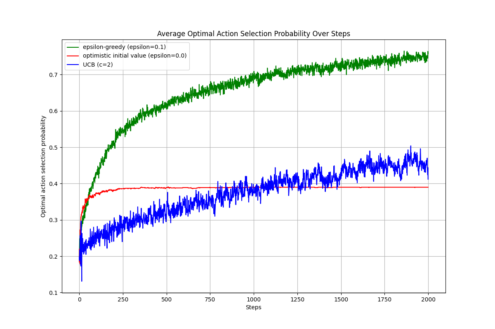

# 2b: Action Selection Strategies
$q*(a)$ is the true value of action a, which is unknown to the agent. The agent estimates $q*(a)$ based on the rewards received from taking action a. The optimal action is the one with the highest true value $q*(a)$.

$Q(a)$ is the estimated value of action a, which is updated based on the rewards received from taking action a. The agent uses $Q(a)$ to select actions, and the goal is to have $Q(a)$ converge to $q*(a)$ over time.

In this assignment, $q*(a)$ is `[0.3, 0.25, 0.4, 0.45, 0.35]` and the optimal action is a=3 (0-indexed).

And our goal is to compare the performance of three action selection strategies: epsilon-greedy, optimistic initial value, and upper confidence bound. We will implement each strategy, run multiple experiments, and plot the average optimal action selection probability over steps for each algorithm.

## Incremental Update of Action Value Estimation
The action value estimation is updated incrementally using the formula:

$$Q_{n+1}(a) = Q_n(a) + \frac{1}{N(a)}(R - Q_n(a))$$

Where:
- $Q_n(a)$ is the estimated value of action a after n selections.
- $N(a)$ is the number of times action a has been selected.
- $R$ is the reward received from taking action a.

## Epsilon-Greedy
epsilon-greedy action selection strategy selects a random action with probability $\epsilon$ and the action with the highest estimated value $Q(a)$ with probability $1-\epsilon$. The action selection can be expressed as:

$$A_t = \begin{cases}
\text{random action} & \text{with probability } \epsilon \\
\arg\max_a Q(a) & \text{with probability } 1-\epsilon
\end{cases}$$

