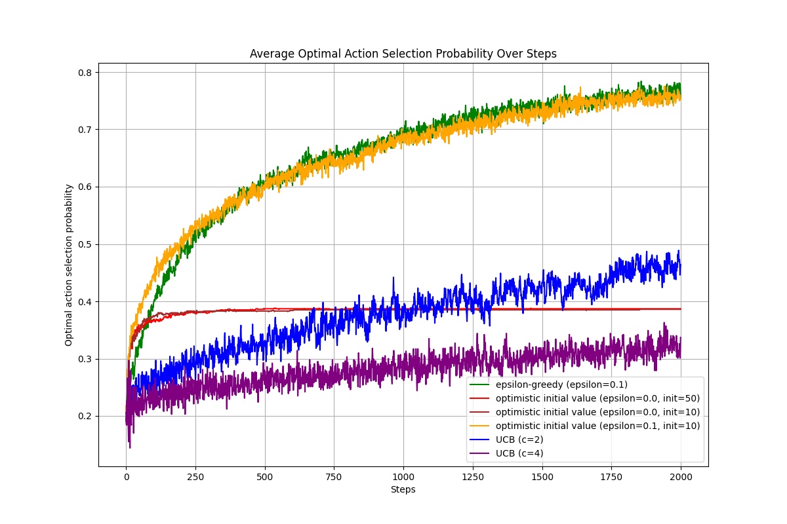
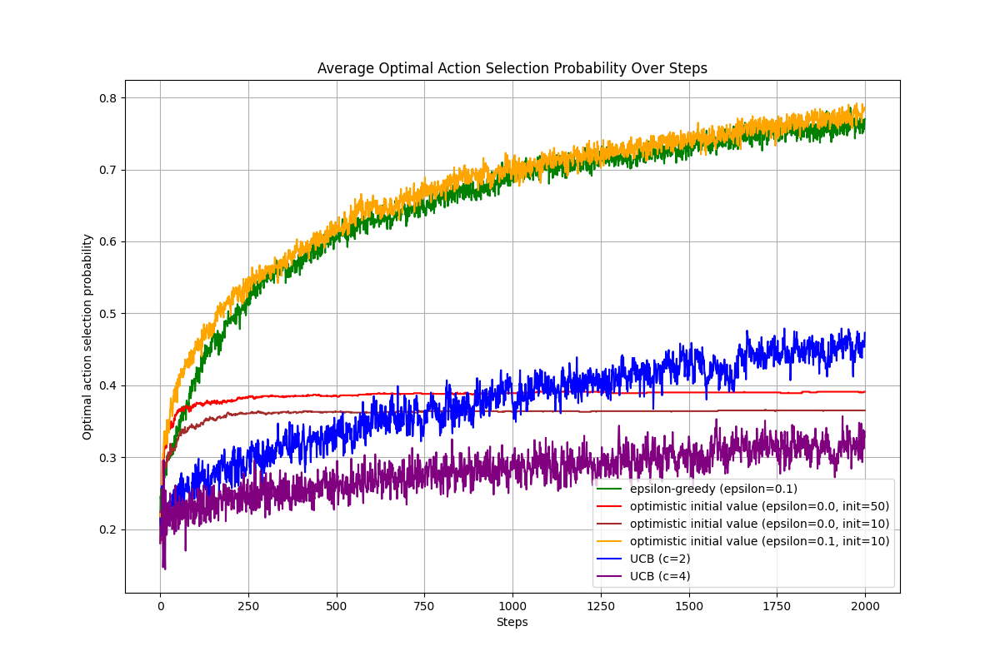

# 2b: Action Selection Strategies
$q*(a)$ is the true value of action a, which is unknown to the agent. The agent estimates $q*(a)$ based on the rewards received from taking action a. The optimal action is the one with the highest true value $q*(a)$.

$Q(a)$ is the estimated value of action a, which is updated based on the rewards received from taking action a. The agent uses $Q(a)$ to select actions, and the goal is to have $Q(a)$ converge to $q*(a)$ over time.

In this assignment, $q*(a)$ is `[0.3, 0.25, 0.4, 0.45, 0.35]` and the optimal action is a=3 (0-indexed).

And our goal is to compare the performance of three action selection strategies: epsilon-greedy, optimistic initial value, and upper confidence bound. We will implement each strategy, run multiple experiments, and plot the average optimal action selection probability over steps for each algorithm.

## Incremental Update of Action Value Estimation
The action value estimation is updated incrementally using the formula:

$$Q_{n+1}(a) = Q_n(a) + \frac{1}{N(a)}(R - Q_n(a))$$

Where:
- $Q_n(a)$ is the estimated value of action a after n selections.
- $N(a)$ is the number of times action a has been selected.
- $R$ is the reward received from taking action a.

```python
Q = np.zeros(env.size) # initial Q
N = np.zeros(env.size) # selected times of each action

# ... Action selection and reward receiving ...

#Update Q: incremental implementation
N[A] += 1
Q[A] += (1/N[A]) * (R - Q[A])
```

## Epsilon-Greedy
epsilon-greedy action selection strategy selects a random action with probability $\epsilon$ and the action with the highest estimated value $Q(a)$ with probability $1-\epsilon$. The action selection can be expressed as:

$$A_t = \begin{cases}
\text{random action} & \text{with probability } \epsilon \\
\arg\max_a Q(a) & \text{with probability } 1-\epsilon
\end{cases}$$

```python
Q = np.zeros(env.size)
N = np.zeros(env.size)

for i in range(n):
  if np.random.rand() > epsilon:    # greedy action selection with the prob. (1-epsilon)
    A = argmax(Q) # select the action with the highest estimated value

  else:
    A = np.random.randint(env.size) # exploration with the prob. (epsilon)

  R = env.reward(A)
```

## Optimistic Initial Value
Optimistic initial value action selection strategy initializes the estimated values $Q(a)$ to a high value (optimistic) and selects the action with the highest estimated value. The action selection can be expressed as:

$$A_t = \arg\max_a Q(a)$$

Where $Q(a)$ is initialized to a high value (e.g., 10) to encourage exploration.

```python
Q = np.zeros(env.size) * init_value # optimistic initial value
N = np.zeros(env.size)         

# ... Action selection and reward receiving ...

N[A] += 1
Q[A] += (1/N[A]) * (R - Q[A])
```

## Upper Confidence Bound (UCB)
Upper confidence bound action selection strategy selects the action that maximizes the upper confidence bound of the estimated value. The action selection can be expressed as:

$$A_t = \arg\max_a \left[ Q(a) + c \sqrt{\frac{\ln t}{N(a)}} \right]$$

Where:
- $Q(a)$ is the estimated value of action a.
- $c$ is a confidence level parameter that controls the degree of exploration.
- $t$ is the current time step.
- $N(a)$ is the number of times action a has been selected.

```python
Q = np.zeros(env.size)
N = np.zeros(env.size)

N = N + 0.00001 #avoding zero-division
#iteration
for i in range(n):
    #upper confidence bound
    UCB = c_UCB * np.sqrt(np.log(i + 1) / N) # [a1, a2, a3, a4, a5] : UCB for each action
    A = argmax(Q + UCB)
    R = env.reward(A)

    N[A] += 1
    #undo N treatment if it avoids zero
    if N[A] == 1.00001:
        N[A] -= 0.00001

    #incremental implementation
    Q[A] += (1 / N[A]) * (R - Q[A])
    #save the current action
    hist_A.append(A)
```

## Results
```python
max_A = argmax(env.q)
# Calculate boolean arrays indicating if the optimal action was selected
is_optimal_EGreedy = (A_EGreedy == max_A)
is_optimal_OPT = (A_OPT == max_A)
is_optimal_UCB = (A_UCB == max_A)

# Compute the average optimal action selection probability over experiments
mean_optimal_prob_EGreedy = np.average(is_optimal_EGreedy, axis=0)
mean_optimal_prob_OPT = np.average(is_optimal_OPT, axis=0)
mean_optimal_prob_UCB = np.average(is_optimal_UCB, axis=0)
```





보라색 선과 파란색 선은 각각 UCB에서 c=4와 c=2일 경우의 결과를 나타낸다. c=4일 경우 약 0.3 부근에서 거의 무작위 선택 수준으로 수렴하고, c=2일 경우에는 약 0.5 부근에 수렴하는 것을 볼 수 있다. 이는 c 값이 높을수록 탐험이 더 많이 이루어지기 때문이며, c=4의 경우 탐험이 너무 많아져서 최적 행동 선택 확률이 낮아지는 것을 보여준다. 반면에 c=2의 경우 비교적 최적 행동 선택 확률이 더 높게 나타난다.

초록색 선은 epsilon-greedy에서 epsilon=0.1일 때의 결과를 나타낸다. 약 0.8 부근에서 수렴하는 것을 볼 수 있으며, 이는 epsilon-greedy가 탐험과 활용을 적절히 균형 있게 수행하기 때문이라고 할 수 있다.

노란색 선은 epsilon-greedy에서 epsilon=0.1에 추가로 초기값이 10일 때의 결과를 나타낸다. 약 0.8 부근에서 수렴하는 것을 볼 수 있다. 낙관적 초기값(Optimistic Initial Value)과  epsilon-greedy 기법을 병행했을 경우, 초반 구간(약 0.5 부근까지)에서  epsilon-greedy만 사용했을 때보다 최적 행동 선택 확률이 월등히 높은 것을 볼 수 있다. 이후 최종적인 수렴 수치는 비슷해지지만, 초기 탐색 속도와 효율성 면에서 낙관적 초기값이 긍정적인 시너지 효과를 낸다는 것을 알 수 있다.

빨간색 선과 갈색 선은 각각 낙관적 초기값 방법에서 초기값이 50과 10일 때의 결과를 나타낸다. 여러 번 시행을 해본 결과, 어떨 때는 빨간색이 더 높고 어떨 때는 갈색이 더 높으며 서로 비슷하게 움직이기도 한다. 이 결과를 바탕으로 단순히 낙관적 초기값만으로는 장기적인 최적 행동 선택 확률에 결정적인 영향을 주지 않는 것으로 보인다. 이는 초기 탐색이 끝난 후, 변화하는 가치 추정치를 지속적으로 업데이트하고 탐색을 유지할 별도의 방법(UCB, psilon-greedy등)이 부족하기 때문으로 보인다.

결론적으로, UCB는 c 값에 따라 탐색의 강도가 민감하게 변하며,  epsilon-greedy는 안정적인 수렴 성능을 보여주었다. 특히 낙관적 초기값은 학습 초기 단계에서 탐색을 강력하게 유도하여 성능 향상을 돕지만, 단독으로 사용되기보다는  epsilon-greedy와 같은 전략과 결합했을 때 가장 효율적인 학습 곡선을 그려낸다는 점을 알 수 있었다.


**Results Summary:**
- UCB with c=4 converges to around 0.3, indicating excessive exploration leading to lower optimal action selection probability.
- UCB with c=2 converges to around 0.5, showing a better balance between exploration and exploitation.
- Epsilon-greedy with epsilon=0.1 converges to around 0.8, demonstrating a good balance between exploration and exploitation.
- Optimistic initial value results depend on the chosen initial value and random outcomes, so a single run is not enough to conclude that one setting is always better than another.
- To compare optimistic initial values fairly, multiple independent runs should be averaged and then analyzed.
- Combining optimistic initial value with epsilon-greedy can improve early exploration, but the final performance still depends on the balance between exploration and exploitation.