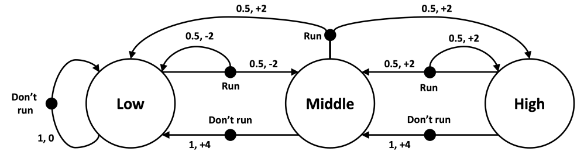

# Value Iteration for Optimal Policy

## Bellman Optimality Equation

The Bellman optimality equation is a fundamental concept in reinforcement learning that describes the relationship between the optimal value of a state and the optimal values of its next states under an optimal policy.

<!-- $$v_{*}(s) = \max_a \sum_{s', r} p(s', r|s, a) [r + γ v_{*}(s')]$$ -->

$$v_{*}(s) = \max_a \sum_{s', r} p(s', r|s, a) [r + \gamma v_{*}(s')]$$

Where:
- $v_{*}(s)$: optimal value of state $s$
- $a$: action to take in state $s$
- $r$: reward received
- $s'$: next state after taking action $a$
- $\gamma$: discount factor (determines importance of future rewards)
- $p(s',r | s, a)$: probability of transitioning to state $s'$ and receiving reward $r$ from state $s$ by taking action $a$

## Value Iteration Update Rule

Value iteration is an algorithm that repeatedly applies the **Bellman optimality backup** operation to compute the optimal value function and policy.

### Update Rule

In each iteration, update the value of each state $s$ using:

$$V(s) \leftarrow \max_a \sum_{s', r} p(s', r|s, a) [r + \gamma V(s')]$$

This expands to computing the Q-value for each action and selecting the maximum:

$$Q(s, a) = \sum_{s', r} p(s', r|s, a) [r + \gamma V(s')]$$

$$V(s) \leftarrow \max_a Q(s, a)$$

### Algorithm

1. **Initialize**: Set $V(s) = 0$ for all states $s$.
2. **Loop until convergence** (δ < θ):
   - For each state $s$:
     - Store old value: $v_{old} = V(s)$
     - Compute Q-values for all actions:  
       $Q(s, a) = \sum_{s', r} p(s', r|s, a) [r + \gamma V(s')]$ for each $a$
     - Update value: $V(s) \leftarrow \max_a Q(s, a)$
     - Track change: $\delta = \max(\delta, |v_{old} - V(s)|)$
3. **Extract optimal policy**: For each state $s$:
   - $\pi^*(s) = \arg\max_a \sum_{s', r} p(s', r|s, a) [r + \gamma V(s')]$

### Convergence Condition

The algorithm terminates when the maximum change in value function across all states falls below threshold $\theta$:

$$\delta < \theta$$

Smaller $\theta$ ensures closer approximation to true optimal values, at the cost of more iterations.

## Climbing Robot Environment



**Configuration**:
- States: {Low, Middle, High}
- Actions: {Run (0), Do not run (1)}
- Initialize: $V(Low) = V(Middle) = V(High) = 0$
- Discount factor: $\gamma = 0.8$

```
==========================================================
Total Iteration: 43
Optimal Value Function (V*):
  V(Low) = 4.9997
  V(Middle) = 8.2351
  V(High) = 10.5881
Optimal Policy (pi*):
  pi*(Low) = Do not run
  pi*(Middle) = Run
  pi*(High) = Do not run
```

## Results Interpretation

### Optimal Value Function

- **V*(Low) ≈ 5.00**: The optimal value from Low state reflects conservative action (staying); climbing risk/reward ratio is unfavorable.
- **V*(Middle) ≈ 8.24**: Higher value than Low because climbing from Middle towards High has better expected return due to positive reward structure.
- **V*(High) ≈ 10.59**: Highest value; staying at High yields consistent positive reward and avoids downward risk.

### Optimal Policy

- **Low → "Do not run"**: Risk of falling back is not worth potential Middle state, so maintain stable +1 reward.
- **Middle → "Run"**: Opportunity to reach High (with +2 reward probability) outweighs risk of returning to Low.
- **High → "Do not run"**: Secure position; taking action risks dropping to Middle despite potential +2 reward.

The optimal policy balances exploration (Middle: take risk to climb) with exploitation (Low/High: play it safe).

## Key Observations

1. **Convergence**: Algorithm converged in 43 iterations with $\theta = 10^{-4}$.
2. **Discount Factor Impact** ($\gamma = 0.8$): Moderate discounting makes near-term rewards more valuable; encourages stability over risky climbs.
3. **Structured Exploration**: The learned policy shows intelligent risk-taking only from the intermediate state where risk-reward ratio is favorable.