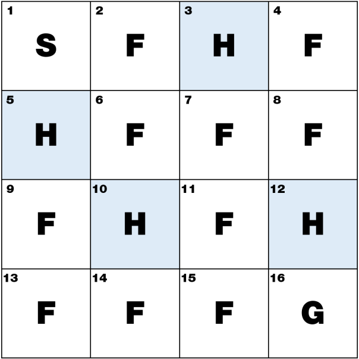

# Monte Carlo Control for Frozen Lake
In this homework, we implement the Monte Carlo Control algorithm to learn an optimal policy in the Frozen Lake environment. The agent interacts with the environment by generating episodes, estimating action values from observed returns, and improving the policy using an epsilon-greedy strategy.

## Monte Carlo Control
Monte Carlo Control is a reinforcement learning method that estimates the action-value function $q_\pi(s, a)$ from sampled episodes. Instead of using a model of the environment, it learns from complete trajectories of experience.

In first-visit Monte Carlo Control, each state-action pair is updated only the first time it appears in an episode. The return is computed backward from the end of the episode as:

$$ G_t = R_{t+1} + \gamma R_{t+2} + \gamma^2 R_{t+3} + ... $$

Then the action-value estimate is updated by averaging all observed returns for that state-action pair.

The policy is improved by choosing the action with the highest estimated Q-value. To balance exploration and exploitation, the implementation uses an epsilon-greedy policy:
- with probability epsilon, a random action is selected
- otherwise, the action with the maximum Q-value is chosen

## Frozen Lake Environment
The Frozen Lake environment is a 4x4 grid world. The agent starts at the top-left corner and aims to reach the goal at the bottom-right corner while avoiding holes.

The environment used in this homework has the following characteristics:
- Start state: (0, 0)
- Goal state: (3, 3)
- Hole states: (0, 2), (1, 0), (2, 1), (2, 3)
- Actions: Up, Down, Left, Right

This environment is deterministic, meaning that the agent's actions will always lead to the intended outcome. The reward structure is as follows:
- +2 for reaching the goal
- -2 for falling into a hole
- 0 for all other transitions

epsilon is set to 0.2, meaning the agent will explore randomly 20% of the time and exploit the learned policy 80% of the time.

$\gamma$ is set to 1.0, indicating that future rewards are not discounted and the agent values long-term returns equally to immediate rewards.



## Implementation
The code is organized as follows:
1. Define the Frozen Lake environment and the state transition rules.
2. Initialize the Q-table, return history, and visit counter for every state-action pair.
3. Generate episodes using an epsilon-greedy policy.
4. Apply first-visit Monte Carlo updates to estimate action values.
5. Extract the final policy by selecting the action with the highest Q-value in each state.

The main data structures are:
- q_table: stores the estimated action values for each state
- returns: stores all observed returns for each state-action pair
- visits: counts how many times each state-action pair has been updated

The helper function argmax() is used to break ties randomly when multiple actions have the same maximum Q-value.

## Result
After training, the learned policy is visualized on the grid using arrows for actions, H for holes, and G for the goal. The resulting policy shows the agent's preferred path toward the goal while avoiding dangerous states.

```
> v H v
H > v <
v H v H
> > > G
```

## Conclusion
In this homework, we implemented Monte Carlo Control for the Frozen Lake environment. By repeatedly sampling episodes and updating action values from observed returns, the agent gradually learns a policy that improves its chance of reaching the goal successfully.
