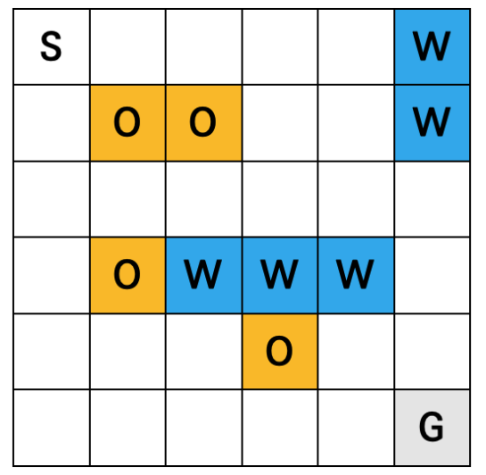
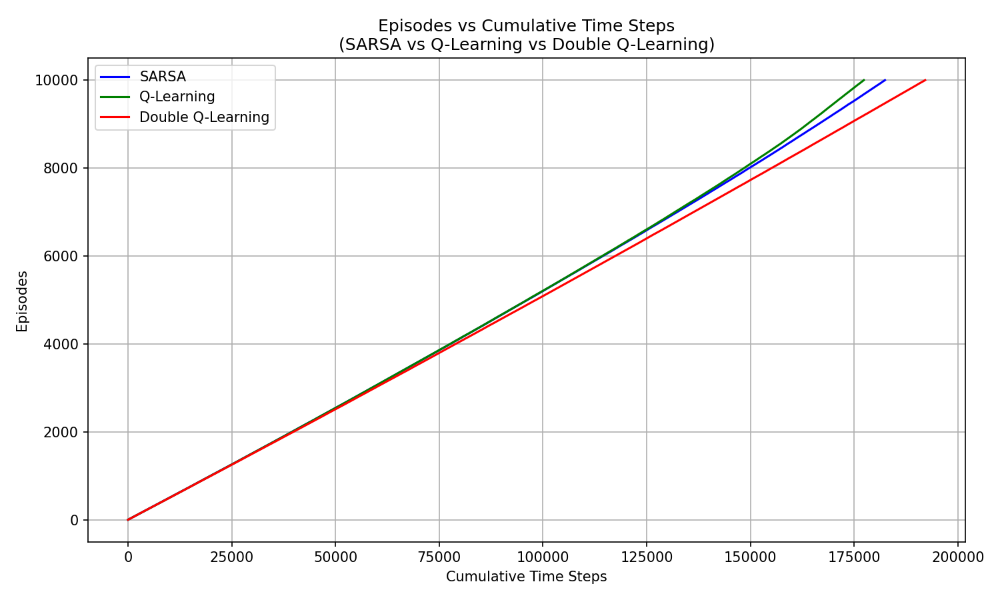
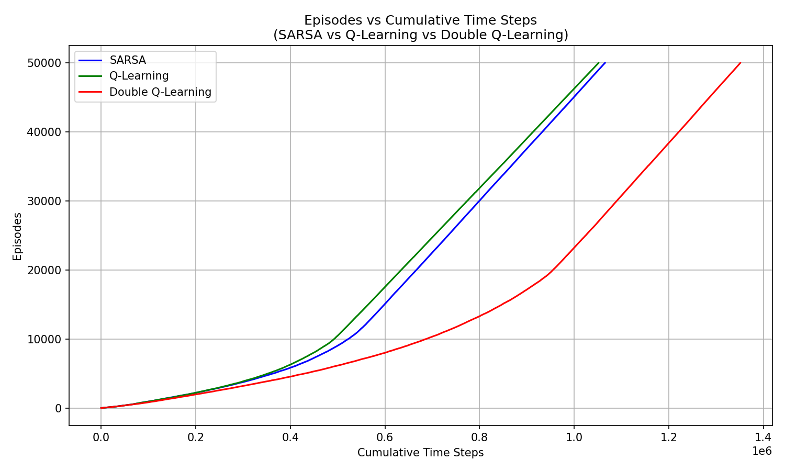

# Temporal Difference Learning
Temporal Difference Learning (TD Learning) is a reinforcement learning method that combines ideas from Monte Carlo methods and dynamic programming. It allows an agent to learn from incomplete episodes by updating value estimates based on the difference between predicted and actual rewards.

TD Learning updates the value function $V(s)$ for a state $s$ using the following formula:

$$ V(s) \leftarrow V(s) + \alpha [R_{t+1} + \gamma V(s_{t+1}) - V(s)] $$

Where:
- $\alpha$ is the learning rate, which determines how much the value function is updated based on new information.
- $R_{t+1}$ is the reward received after taking an action in state $s$ and transitioning to state $s_{t+1}$.
- $\gamma$ is the discount factor, which determines the importance of future rewards.

## SARSA Learning
SARSA (State-Action-Reward-State-Action) is an on-policy TD control algorithm that learns the action-value function $Q(s, a)$ for a given policy. The update rule for SARSA is as follows:

$$ Q(s, a) \leftarrow Q(s, a) + \alpha [R_{t+1} + \gamma Q(s_{t+1}, a_{t+1}) - Q(s, a)] $$

Where:
- $Q(s, a)$ is the estimated action-value for taking action $a$ in state $s$.
- $a_{t+1}$ is the action taken in the next state $s_{t+1}$ according to the current policy.

The agent updates its action-value estimates based on the action taken in the next state, which is why SARSA is considered an on-policy algorithm.

## Q-Learning
Q-Learning is an off-policy TD control algorithm that learns the optimal action-value function $Q^*(s, a)$ regardless of the policy being followed. The update rule for Q-Learning is as follows:

$$ Q(s, a) \leftarrow Q(s, a) + \alpha [R_{t+1} + \gamma \max_{a'} Q(s_{t+1}, a') - Q(s, a)] $$

Where:
- $Q(s, a)$ is the estimated action-value for taking action $a$ in state $s$.
- $\max_{a'} Q(s_{t+1}, a')$ is the maximum action-value for the next state $s_{t+1}$.

The agent updates its action-value estimates based on the maximum possible reward in the next state, which is why Q-Learning is considered an off-policy algorithm.

## Double Q-Learning
Double Q-Learning is an extension of Q-Learning that addresses the overestimation bias in action-value estimates. It maintains two separate action-value functions, $Q_1$ and $Q_2$, and updates them alternately. The update rules for Double Q-Learning are as follows:

$$ Q_1(s, a) \leftarrow Q_1(s, a) + \alpha [R_{t+1} + \gamma Q_2(s_{t+1}, \arg\max_{a'} Q_1(s_{t+1}, a')) - Q_1(s, a)] $$
$$ Q_2(s, a) \leftarrow Q_2(s, a) + \alpha [R_{t+1} + \gamma Q_1(s_{t+1}, \arg\max_{a'} Q_2(s_{t+1}, a')) - Q_2(s, a)] $$

Where:
- $Q_1(s, a)$ and $Q_2(s, a)$ are the two separate action-value estimates for taking action $a$ in state $s$.
- The action selection for the next state is based on the maximum action-value from the other Q-function, which helps to reduce overestimation bias.

# Drone Delivery Environment
In this homework, we will implement a drone delivery environment.


   
**grid(6x6):**
S: Start position (0, 0)
G: Goal position (5, 5)
O: Obstacles (1,1), (1,2), (3,1), (4,3)
W: Windy area (0,5), (1,5), (3,2), (3,3), (3,4)

**state space:** (x, y, b) where x and y are the coordinates of the drone and b is the remaining battery level

$$(x, y, b) \quad \text{where} \quad x \in \{0, 1, 2, 3, 4, 5\}, \quad y \in \{0, 1, 2, 3, 4, 5\}, \quad b \in \{0, 1, ..., 20\}$$

**action space:** up, down, left, right

$$A = \{0: \text{up}, ~1: \text{down}, ~2: \text{left}, ~3: \text{right}\}$$

**reward:** -1 for each step, -3 when the drone leaves the windy area or attempts to pass through an obstacle, -50 when the drone's battery is depleted, and +100 when the drone reaches the goal.

$$ R(s, a) = \begin{cases}
-1 & \text{for each step or attempts to move to obstacle(but can't go)} \\
-3 & \text{when the drone leaves the windy area} \\
-50 & \text{when the drone's battery is depleted} \\
\;\; +100 & \text{when the drone reaches the goal}
\end{cases} $$

**state transition:** The state transition is deterministic: actions deterministically produce the next state. If an action would result in an invalid position (for example, moving into an obstacle or outside the grid due to wind), the transition is considered invalid. The transition probabilities can be defined as follows:

$$ P(s'|s, a) = \begin{cases}
1 & \text{if the action leads to a valid state transition} \\
0 & \text{otherwise}
\end{cases} $$

## Learning Optimal Policy
Train the agent using SARSA, Q-Learning, and Double Q-Learning algorithms to find the optimal policy for navigating the drone from the start position to the goal while avoiding obstacles and managing battery life effectively. 


We use the following hyperparameters for training:

$$\epsilon = 0.2, \quad \alpha = 0.01, \quad \text{episodes} = 10{,}000, \quad \text{battery level} = 20 $$


After training, visualize the optimal paths learned by each algorithm on the grid.

```
=== SARSA Optimal Path ===
+---+---+---+---+---+---+
| S | . | . | . | . | W |
+---+---+---+---+---+---+
| v | O | O | . | . | W |
+---+---+---+---+---+---+
| > | > | v | . | . | . |
+---+---+---+---+---+---+
| . | O | > | > | v | . |
+---+---+---+---+---+---+
| . | . | . | O | v | . |
+---+---+---+---+---+---+
| . | . | . | . | > | G |
+---+---+---+---+---+---+

=== Q-Learning Optimal Path ===
+---+---+---+---+---+---+
| S | . | . | . | . | W |
+---+---+---+---+---+---+
| v | O | O | . | . | W |
+---+---+---+---+---+---+
| > | > | v | . | . | . |
+---+---+---+---+---+---+
| . | O | > | > | > | v |
+---+---+---+---+---+---+
| . | . | . | O | . | v |
+---+---+---+---+---+---+
| . | . | . | . | . | G |
+---+---+---+---+---+---+

=== Double Q-Learning Optimal Path ===
[Warning] Battery Exhausted.
+---+---+---+---+---+---+
| S | > | > | > | > | > |
+---+---+---+---+---+---+
| . | O | O | . | . | W |
+---+---+---+---+---+---+
| . | . | . | . | . | . |
+---+---+---+---+---+---+
| . | O | W | W | W | . |
+---+---+---+---+---+---+
| . | . | . | O | . | . |
+---+---+---+---+---+---+
| . | . | . | . | . | G |
+---+---+---+---+---+---+
```

This is the graph of cumulative timesteps for each algorithm:   


그래프는 Episode마다 누적된 Timestep을 보여준다. 즉, 각 Episode가 끝날 때 걸린 Timestep을 누적하여 나타낸 것이다. 사실 내가 기대했던 것은 Episode가 진행될 때마다 Timestep이 줄어들어, 학습이 진행될수록 최적 경로를 더 빨리 찾게 되어 그래프의 기울기가 급격히 올라가는 형태였다.
그러나 SARSA, Q-Learning, Double Q-Learning 모두 선형적으로 증가하는 그래프를 보여주었다. 이는 각 Episode마다 걸리는 Timestep이 일정하게 유지되고 있음을 의미한다. 즉, 학습이 진행되어도 최적 경로를 찾는 데 걸리는 시간이 크게 줄어들지 않고 있다는 것을 나타낸다.

이러한 결과는 몇 가지 이유로 설명될 수 있다. 첫째, Battery Level이 20으로 아주 낮게 설정되어 있어, 에이전트가 최적 경로를 찾기 전에 배터리가 소진되는 경우가 많았을 수 있다. 둘째, $\alpha$나 $\epsilon$와 같은 하이퍼파라미터가 최적 경로를 빠르게 학습하는 데 적절하지 않았을 수 있다. 예를 들어, $\epsilon$이 너무 높으면 에이전트가 탐험을 너무 많이 하여 최적 경로를 찾는 데 시간이 오래 걸릴 수 있다. 반대로, $\alpha$가 너무 낮으면 학습 속도가 느려져 최적 경로를 찾는 데 더 많은 Episode가 필요할 수 있다. 셋째, 학습량이 충분하지 않았을 수도 있다. 10,000 Episode가 충분히 많아 보이지만, 실제로는 더 많은 Episode가 필요했을 수 있다. 특히 Double Q-Learning의 경우, 두 개의 Q-함수를 번갈아 업데이트하기 때문에 최적 경로를 학습하는 데 더 많은 Episode가 필요할 수 있다.

따라서 이 결과를 바탕으로 또 한번의 실험을 진행해보았다:

$$\epsilon = 0.2, \quad \alpha = 0.01, \quad \text{episodes} = 50{,}000, \quad \text{battery level} = 500 $$

```
=== SARSA Optimal Path ===
+---+---+---+---+---+---+
| S | . | . | . | . | W |
+---+---+---+---+---+---+
| v | O | O | . | . | W |
+---+---+---+---+---+---+
| > | > | v | . | . | . |
+---+---+---+---+---+---+
| . | O | > | > | > | v |
+---+---+---+---+---+---+
| . | . | . | O | . | v |
+---+---+---+---+---+---+
| . | . | . | . | . | G |
+---+---+---+---+---+---+

=== Q-Learning Optimal Path ===
+---+---+---+---+---+---+
| S | > | > | > | > | v |
+---+---+---+---+---+---+
| . | O | O | . | . | v |
+---+---+---+---+---+---+
| . | . | . | . | . | v |
+---+---+---+---+---+---+
| . | O | W | W | W | v |
+---+---+---+---+---+---+
| . | . | . | O | . | v |
+---+---+---+---+---+---+
| . | . | . | . | . | G |
+---+---+---+---+---+---+

=== Double Q-Learning Optimal Path ===
+---+---+---+---+---+---+
| S | . | . | . | . | W |
+---+---+---+---+---+---+
| v | O | O | . | . | W |
+---+---+---+---+---+---+
| > | > | > | v | . | . |
+---+---+---+---+---+---+
| . | O | W | > | > | v |
+---+---+---+---+---+---+
| . | . | . | O | . | v |
+---+---+---+---+---+---+
| . | . | . | . | . | G |
+---+---+---+---+---+---+
```

